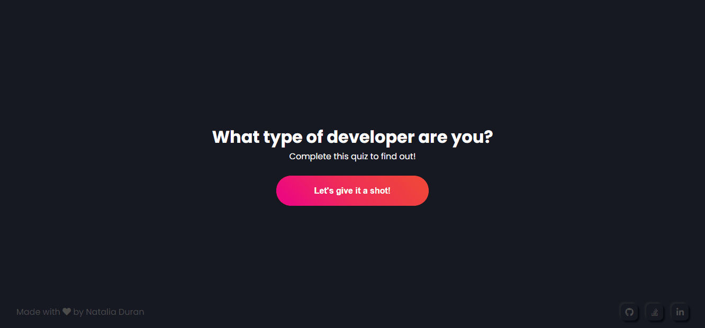

# Quiz-app

Esta es una quiz app destinada a programadores. EL objetivo de esta aplicación es perfilar al usuario en uno de los tres roles: Frontend Developer, Backend Developer o Fullstack developer. 

El usuario tiene la opción de recorrer dos flujos. En uno de los flujos, el usuario tiene la opción de permanencer anónimo y no ingresar su nombre. En el otro flujo el usuario puede ingresar su nombre y éste será guardado para futuros ingresos a la aplicación, de esta forma la próxima vez que el usuario ingrese a la página principal se le mostrará una vista personalizada, ya que se tienen guardados sus datos. 

Si el usuario decide ingresar su nombre, se le habilitará en la página principal, un menú en la parte superior derecha, donde podrá ver su información o borrar toda su data si así lo desea. 

Toda la aplicación esta en inglés y los resultados no están basadas en ningún estudio o teoría científico.  

